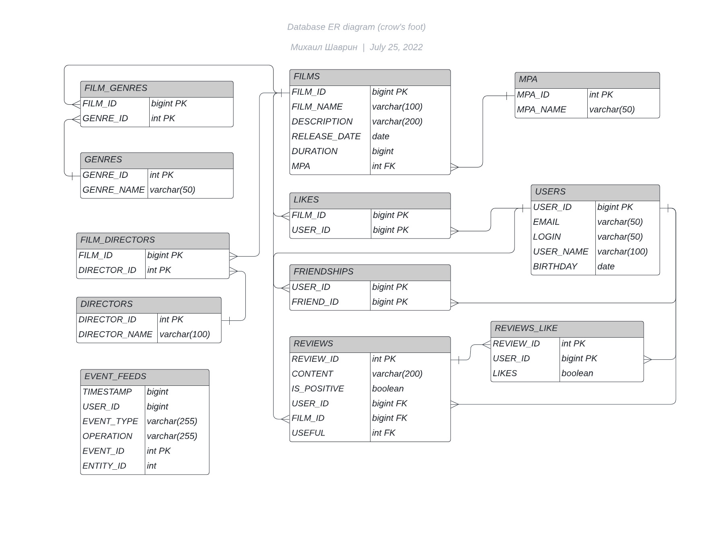

# java-filmorate
Template repository for Filmorate project.
#### Диаграма проекта:

#### Запрос на получение всех пользователей:

SELECT *  
FROM USERS

#### Запрос на получение пользователя по id:

SELECT *  
FROM USERS  
where USER_ID = ?

#### Запрос на получение всех фильмов:

SELECT *  
FROM FILMS

#### Запрос на получение фильма по id:

SELECT *  
FROM FILMS  
where FILM_ID = ?

#### Запрос на получение друзей пользователя:

SELECT U.USER_ID,  
       U.USER_NAME, 
       U.EMAIL, 
       U.BIRTHDAY,  
       U.LOGIN   
FROM FRIENDSHIPS as F  
LEFT JOIN USERS U ON F.FRIEND_ID = U.USER_ID  
WHERE F.USER_ID = ?

#### Запрос на получение общих друзей:

SELECT U.USER_ID, 
       U.USER_NAME, 
       U.EMAIL, 
       U.BIRTHDAY, 
       U.LOGIN  
FROM FRIENDSHIPS AS F INNER JOIN FRIENDSHIPS F2 ON F.FRIEND_ID = F2.FRIEND_ID  
LEFT JOIN USERS U ON F.FRIEND_ID = U.USER_ID  
WHERE F.USER_ID = ? AND F2.USER_ID = ?

#### Запрос на получение популярных фильмов:

SELECT F.FILM_ID AS FILM_ID, 
       F.DESCRIPTION AS DESCRIPTION, 
       F.DURATION AS DURATION, 
       F.FILM_NAME AS FILM_NAME,  
       F.MPA AS MPA,  
       F.RELEASE_DATE AS RELEASE_DATE 
FROM FILMS F  
LEFT JOIN LIKES AS L ON F.FILM_ID = L.FILM_ID   
GROUP BY F.FILM_ID 
ORDER BY COUNT(DISTINCT L.USER_ID) DESC LIMIT ? 